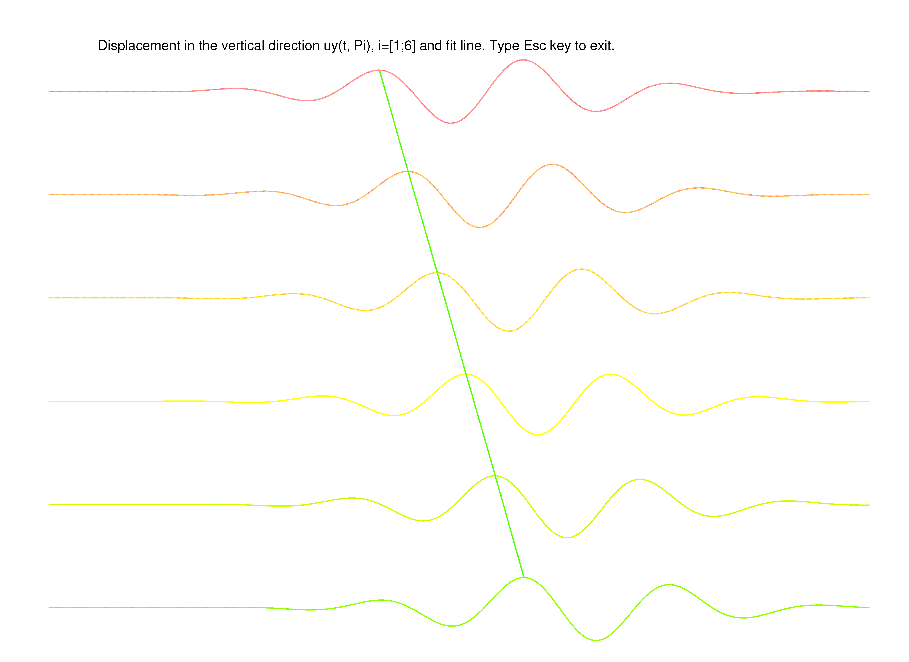
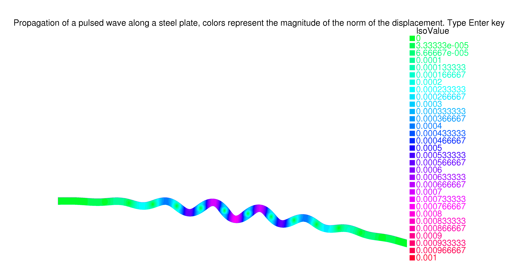

# PhaseVelocity Code

PhaseVelocity is a FreeFEM++ Code to compute the phase velocity of an ultrasonic pulse $g(t)$, while it travels along a transversally annular isotropic plate, see [Figure 1](/MathICIMAF/Phase-Velocity-Code/tree/main/graficos_curva/sectorcircular.png)

**Figure 1:** Annular isotropic plate.

The pulse (depending on the frequency $f_0$) is applied on the black boundary of the plate and it is given by (see [Figure 2](/MathICIMAF/Phase-Velocity-Code/tree/main/graficos_curva/pulse_new.png)):

<!--  -->

 $g(t)=\phi\ \sin \left( 2\ \pi\ {\it f_0}\ t \right){{e}^{-0.9134221857\ {{\it f_0}}^{2} \left( t-\ \frac{9}{4 {\it f_0}} \right) ^{2}}},\ \ for\ \ t\geq 0$ 

**Figure 2:** Pulse $g(t)$ for $\it f_0 = 0.5\ MHz$ and $\phi = 1.0\times 10^{-3}m$.

**PhaseVelocity code** implements a combination of the velocity method (PVM) [^1] with the finite element method (FEM). The FEM-PVM [^2]  is based on the numerical solution of the wave propagation equations, which is computed using a second order difference scheme for the temporal variable and FEM triangular quadratic Lagrange discretization for spatial variables. The phase velocity for a given frequency is obtained from the computed displacements at few points on the top of the plate, in a similar way as the case of thin plane plates [^3]. 
Running the code for several frequency values, an array of frequency vs phase velocity points is obtained. The phase velocity dispersion curve can be computed fitting these points.  

## Requirements
**PhaseVelocity Code** has been tested with FreeFem++ 3.56 and above and should run on most personal laptops and desktop computers.

## Input

- $f_0$ in the interval $[1,15] \times 10^5 Hz\ (100kHz - 1.5MHz)$

- Curvature &kappa; in the interval $[0.01,90]\ m^{-1} $  

## Functionality
- Computation of the displacements of points of the plate.
- Plot of the wave propagation.
- Computation of the phase velocity.

## Graphical Output

**Figure 3:** Vertical displacements of 6 selected points on the top of the plate

**Figure 4:** Deformation of the curved steel plate for a fixed time after emitting a pulse. Colors correspond to the intensity of the norm of the displacement field.

## Note
To execute the code the funcions.edp file and PhaseVelocity.edp file must be in the same folder. Run the main file PhaseVelocity.edp

## Bibliography
[^1]: [E. Moreno, N. Galarza, B. Rubio and J. A. Otero, Phase velocity method for guided wave measurements in composite plates, in UIA Symposium 2014, Physics Procedia, Vol. 63,  54--60, 2015.]
[^2]: M. Cruz, V. Hernández,  J. Estrada, E. Moreno, A. Mansur, Phase velocity method for computing dispersion curves in curved  plate waveguides, to appear in journal REVISTA INVESTIGACIÓN OPERACIONAL, 2023.
[^3]: M. Cruz, A. Mansur, E. Moreno, V. Hernández and J. Estrada, Wave Propagation Code with FreeFEM, https://github.com/MathICIMAF/Wave-Propagation-Code-with-FreeFEM.
